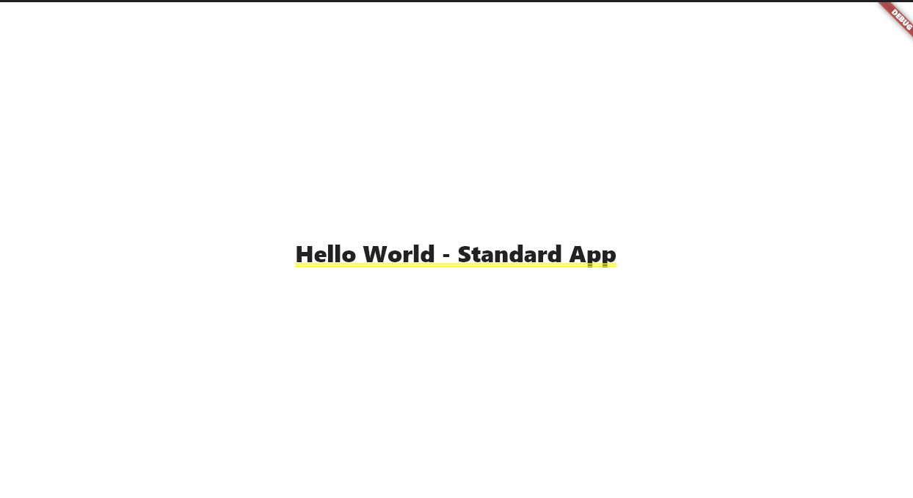
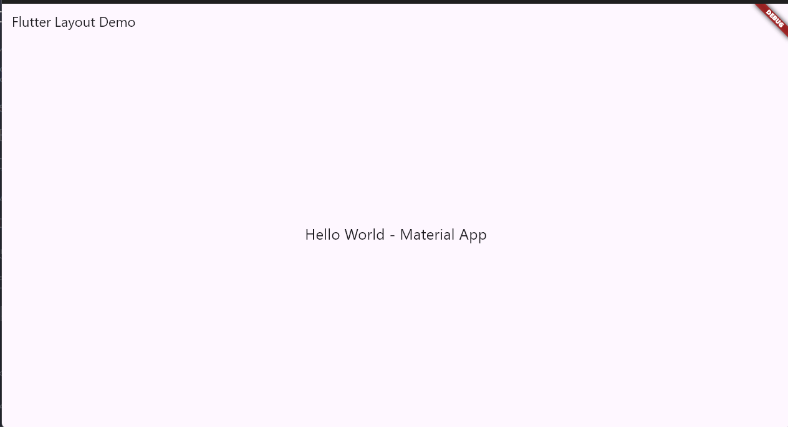

# 📱 Basic Layout Flutter

## 👨‍💻 Author
- **Nama:** Afgan Galih Fauz Amjad Amadinah  
- **NIM:** 2341760004
- **Kelas:** SIB - 3C 

Project ini berisi implementasi dasar **layout Flutter** dengan tiga jenis pendekatan: **Standard**, **Material**, dan **Cupertino**.

---

## 💻 Penjelasan Kode

### 1. `main.dart`
Entry point aplikasi dengan home page yang berisi 3 tombol untuk navigasi ke masing-masing jenis layout.

**Komponen utama:**
- `MaterialApp`: Root widget aplikasi  
- `Scaffold`: Struktur dasar halaman (AppBar + Body)  
- `Navigator.push()`: Untuk berpindah halaman  

---

### 2. `standard_app.dart`
Layout paling dasar tanpa framework Material atau Cupertino.

**Komponen utama:**
- `Container`: Widget untuk styling dasar  
- `BoxDecoration`: Untuk background color  
- `textDirection`: Harus diset manual (LTR/RTL)  

**Kegunaan:**  
Untuk widget custom yang tidak butuh fitur Material/Cupertino.

---

### 3. `material_app.dart`
Layout dengan **Material Design** (gaya Android/Google).

**Komponen utama:**
- `MaterialApp`: Root widget Material Design  
- `Scaffold`: Menyediakan AppBar, Body, Drawer otomatis  
- `AppBar`: Top bar dengan title  

**Keuntungan:**  
AppBar otomatis, theme system, ripple effect, support SnackBar/Dialog.  

**Kegunaan:**  
Aplikasi Android atau cross-platform dengan tampilan modern.

---

### 4. `cupertino_app.dart`
Layout dengan desain **iOS (Apple style)**.

**Komponen utama:**
- `CupertinoApp`: Root widget iOS-style  
- `CupertinoPageScaffold`: Equivalent Scaffold untuk iOS  
- `CupertinoNavigationBar`: Navigation bar ala iOS  
- `CupertinoThemeData`: Theme khusus iOS  

**Keuntungan:**  
Native iOS look & feel, smooth iOS transitions.  

**Kegunaan:**  
Aplikasi khusus iOS atau untuk user base iOS.

---

## 🔄 Perbedaan Ketiga Layout

| Aspek        | Standard  | Material        | Cupertino          |
|--------------|-----------|----------------|-------------------|
| **Platform** | Universal | Android         | iOS               |
| **Top Bar**  | Manual    | `AppBar`       | `CupertinoNavigationBar` |
| **Styling**  | Custom    | Material Design | iOS Design        |
| **Theme**    | ❌        | ✅              | ✅                 |
| **Kompleksitas** | Simple | Medium         | Medium            |

---

## 📸 Screenshot
Tambahkan screenshot aplikasi di sini.  
standart_app - 
cupertion_material_app - 

---

